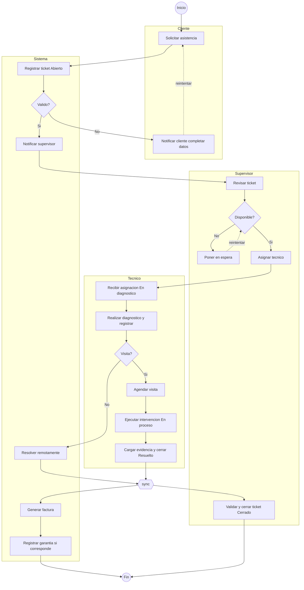
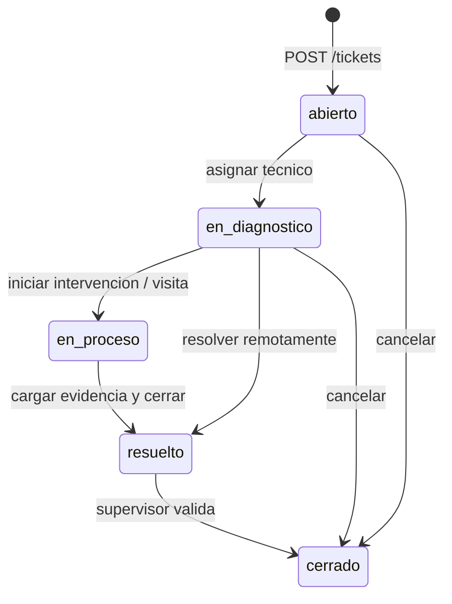

# Diagrama de actividades — TechServ

Flujo completo del ciclo de vida de un ticket de asistencia técnica, organizado por **swimlanes** (Cliente, Sistema, Técnico, Supervisor).

> Ver también: [diagrama-casos-de-uso.md](./diagrama-casos-de-uso.md) · [diagrama-secuencias.md](./diagrama-secuencias.md) · [diagrama-er.md](./diagrama-er.md)

## Swimlanes (carriles)

| Carril | Responsabilidad |
|--------|-----------------|
| **Cliente** | Solicita asistencia, completa datos si faltan |
| **Sistema** | Registro, notificaciones, resolución remota, factura, garantía |
| **Técnico** | Diagnóstico, visita, intervención, evidencia |
| **Supervisor** | Revisión, asignación, validación de cierre |

---

## Flujo principal (resumen)

---

## Estados del ticket en el flujo

El diagrama etiqueta explícitamente estos estados:

| Actividad | Estado (`tickets.estado`) |
|-----------|---------------------------|
| Registrar ticket | `abierto` |
| Recibir asignación | `en_diagnostico` |
| Ejecutar intervención | `en_proceso` |
| Cargar evidencia y cerrar | `resuelto` |
| Validar y cerrar ticket | `cerrado` |

### Máquina de estados (backend)

**Transiciones permitidas** (validar en `PATCH /tickets/{id}/status`):

| Desde | Hacia | Disparador |
|-------|-------|------------|
| `abierto` | `en_diagnostico` | Asignar técnico |
| `en_diagnostico` | `en_proceso` | Agendar visita / iniciar intervención |
| `en_diagnostico` | `resuelto` | Resolución remota (sin visita) |
| `en_proceso` | `resuelto` | Técnico cierra con evidencia |
| `resuelto` | `cerrado` | Supervisor aprueba cierre |
| `*` | `cerrado` | Cancelación (regla de negocio opcional) |

---

## Decisiones del diagrama

### ¿Válido? (Sistema)

Ticket inválido si faltan datos obligatorios del caso de uso:
- urgencia (`<<include>>` clasificar urgencia)
- equipo afectado (`<<include>>` registrar equipo)
- título / descripción

| Resultado | Acción backend |
|-----------|----------------|
| **No** | `422` validación Pydantic + notificar cliente completar datos |
| **Sí** | `201` + notificar supervisor |

### ¿Disponible? (Supervisor)

¿Hay técnico disponible para la zona/urgencia?

| Resultado | Acción |
|-----------|--------|
| **No** | Ticket en espera (estado `abierto` o flag `on_hold`) → reintentar asignación |
| **Sí** | `PUT /tickets/{id}/assign` |

### ¿Visita? (Técnico)

Tras el diagnóstico, ¿requiere visita presencial?

| Resultado | Acción |
|-----------|--------|
| **No** | Sistema: **Resolver remotamente** → salto a `resuelto` |
| **Sí** | **Agendar visita** → **Ejecutar intervención** → evidencia → `resuelto` |

Campo sugerido: `requires_visit: bool` en diagnóstico o ticket.

---

## Actividades → API / servicios

| Actividad | Carril | Implementación | Etapa |
|-----------|--------|----------------|-------|
| Solicitar asistencia | Cliente | `POST /api/v1/tickets` | 1 |
| Registrar ticket (Abierto) | Sistema | INSERT + estado `abierto` | 1 |
| Notificar supervisor | Sistema | NotificationService | 2 |
| Notificar cliente completar datos | Cliente/Sistema | push/email | 2 |
| Revisar ticket | Supervisor | `GET /api/v1/tickets/{id}` | 1 |
| Poner en espera | Supervisor | status o campo `on_hold` | 2 |
| Asignar técnico | Supervisor | `PUT /tickets/{id}/assign` | 2 |
| Recibir asignación | Técnico | notificación + estado `en_diagnostico` | 2 |
| Realizar diagnóstico | Técnico | `POST /tickets/{id}/diagnostics` | 3 |
| Agendar visita | Técnico | `POST /api/v1/appointments` | 2 |
| Ejecutar intervención | Técnico | `POST /tickets/{id}/interventions` | 3 |
| Resolver remotamente | Sistema | endpoint o transición directa a `resuelto` | 3 |
| Cargar evidencia y cerrar | Técnico | photos + `POST /interventions/{id}/close` | 3 |
| Generar factura | Sistema | `POST /invoices` | 4 |
| Validar y cerrar ticket | Supervisor | `PATCH /tickets/{id}/status` → `cerrado` | 2/3 |
| Registrar garantía | Sistema | `POST /equipments/{id}/warranties` | 5 |

---

## Barra de sincronización (fork/join)

Después de **Resolver remotamente** o **Cargar evidencia y cerrar**, el flujo converge en una barra horizontal y se bifurca en:

1. **Sistema** → Generar factura  
2. **Supervisor** → Validar y cerrar ticket  

En backend esto implica:
- Estado `resuelto` es prerequisito para factura y cierre final
- Factura y cierre supervisor pueden ser **paralelos** (no estrictamente secuenciales)
- `cerrado` solo cuando supervisor aprueba (aunque la factura exista)

---

## Flujos alternativos (líneas punteadas)

| Flujo | Descripción |
|-------|-------------|
| Cliente completa datos | Loop: validación fallida → notificación → re-solicitud |
| Reintentar asignación | Técnico no disponible → en espera → reintentar |
| Resolución remota | Salta visita e intervención presencial; va directo al join |

---

## Rol «Sistema» vs backend

Las actividades en el carril **Sistema** no son un actor humano; las implementa el **API Backend**:

- Validaciones automáticas
- Cambios de estado
- Llamadas al servicio de notificaciones
- Generación de factura (job o endpoint)
- Registro de garantía post-cierre

---

## Estado actual del backend

| Parte del flujo | Estado |
|-----------------|--------|
| Auth (todos los actores) | ✅ Etapa 0 |
| Registrar ticket | Pendiente Etapa 1 |
| Asignación / diagnóstico / intervención | Pendiente Etapas 2–3 |
| Factura / garantía / cierre supervisor | Pendiente Etapas 4–5 |

---

## Checklist de implementación por fase

### Etapa 1
- [ ] `POST /tickets` con validación (¿Válido?)
- [ ] Estados `abierto` inicial
- [ ] `GET /tickets` por rol

### Etapa 2
- [ ] Asignación + `en_diagnostico`
- [ ] Cola / en espera si no hay técnico
- [ ] Notificaciones supervisor y técnico
- [ ] Agendar visita

### Etapa 3
- [ ] Diagnóstico + decisión ¿Visita?
- [ ] Resolución remota vs intervención presencial
- [ ] Evidencia + `resuelto`
- [ ] Aprobar cierre supervisor → `cerrado`

### Etapas 4–5
- [ ] Generar factura tras `resuelto`
- [ ] Registrar garantía si corresponde

---

## Coherencia con otros diagramas

| Diagrama | Alineación |
|----------|------------|
| Casos de uso | Cada actividad mapea a uno o más casos de uso |
| Secuencias | Creación y asignación son sub-flujos de este diagrama |
| E/R | Estados persisten en `tickets.estado`; intervención 1:1 |
| Clases | `Ticket.cambiarEstado()`, `Intervencion.cerrar()` |

Este diagrama es la **referencia del workflow completo** — usarlo como guía para la máquina de estados y las reglas de transición en el módulo de tickets.
