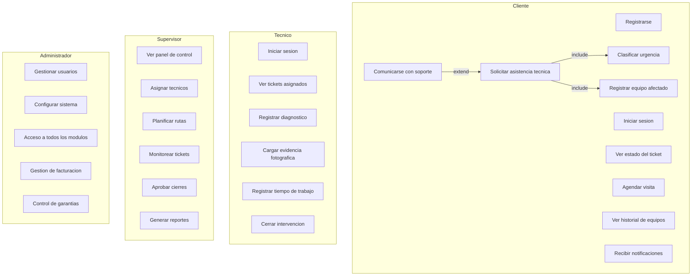

# Diagrama de casos de uso — TechServ

**Sistema de gestión de asistencia técnica**

Referencia funcional del proyecto: actores, casos de uso y relaciones `<<include>>` / `<<extend>>`.

> Ver también: [diagrama-de-clases.md](./diagrama-de-clases.md) · [diagrama-er.md](./diagrama-er.md) · [diagrama-secuencias.md](./diagrama-secuencias.md) · [diagrama-actividades.md](./diagrama-actividades.md)

## Actores

| Actor | Descripción |
|-------|-------------|
| **Cliente** | Solicita servicio, sigue tickets, agenda visitas |
| **Técnico** | Ejecuta intervenciones en campo |
| **Supervisor** | Opera el flujo: asignación, monitoreo, reportes |
| **Administrador** | Configuración, usuarios, acceso total |

**Nota MVP:** el alcance del proyecto también incluye **Área administrativa** (facturación/garantías). En el diagrama esos casos están bajo Administrador; en el backend es un rol aparte (`area_administrativa`).

---

## Vista general

---

## Casos de uso por actor

### Cliente

| Caso de uso | Descripción | Etapa |
|-------------|-------------|-------|
| Registrarse | Alta de cuenta | 0 (Supabase Auth) |
| Iniciar sesión | Login + JWT | 0 ✅ |
| Solicitar asistencia técnica | Crear ticket | 1 |
| Ver estado del ticket | Consulta de ticket | 1 |
| Agendar visita | Cita con técnico | 2 |
| Ver historial de equipos | Listado equipos + intervenciones | 1 / 3 |
| Recibir notificaciones | Push / email | 2 |

**Includes de «Solicitar asistencia técnica»** (obligatorios):
- **Clasificar urgencia** → campo `urgencia` en `POST /tickets`
- **Registrar equipo afectado** → `equipo_id` en ticket (equipo existente o alta previa)

**Extend** (opcional):
- **Comunicarse con soporte** → comentarios en ticket o chat (`POST /tickets/{id}/comments`) — puede ser fase 2

---

### Técnico

| Caso de uso | Descripción | Etapa |
|-------------|-------------|-------|
| Iniciar sesión | Login + JWT | 0 ✅ |
| Ver tickets asignados | Lista filtrada por `tecnico_id` | 1 / 2 |
| Registrar diagnóstico | Alta diagnóstico | 3 |
| Cargar evidencia fotográfica | Upload a Storage | 3 |
| Registrar tiempo de trabajo | Time logs | 3 |
| Cerrar intervención | Firma + cierre | 3 |

---

### Supervisor

| Caso de uso | Descripción | Etapa |
|-------------|-------------|-------|
| Ver panel de control | Dashboard KPIs | 6 |
| Asignar técnicos | `PUT /tickets/{id}/assign` | 2 |
| Planificar rutas | Google Maps / agenda | 2 |
| Monitorear tickets | Lista + filtros en tiempo real | 1 / 2 |
| Aprobar cierres | Validar antes de `cerrado` | 2 / 3 |
| Generar reportes | Export PDF/Excel | 6 |

---

### Administrador

| Caso de uso | Descripción | Etapa |
|-------------|-------------|-------|
| Gestionar usuarios | CRUD users | 0 ✅ |
| Configurar sistema | Parámetros, categorías | 0 / futuro |
| Acceso a todos los módulos | RBAC completo | transversal |
| Gestión de facturación | Facturas, pagos | 4 |
| Control de garantías | Alta y alertas | 5 |

**Rol `area_administrativa`:** comparte *Gestión de facturación* y *Control de garantías* sin acceso total de admin.

---

## Mapeo caso de uso → API backend

| Caso de uso | Endpoint / servicio | Rol |
|-------------|---------------------|-----|
| Registrarse | Supabase `signUp` | — |
| Iniciar sesión | Supabase Auth + `GET /api/v1/me` | todos |
| Solicitar asistencia | `POST /api/v1/tickets` | cliente |
| Clasificar urgencia | campo en body del POST | cliente |
| Registrar equipo | `equipo_id` o `POST /equipments` | cliente |
| Ver estado ticket | `GET /api/v1/tickets/{id}` | cliente |
| Agendar visita | `POST /api/v1/appointments` | cliente / supervisor |
| Ver historial equipos | `GET /api/v1/clients/{id}/equipments` | cliente |
| Recibir notificaciones | FCM + `GET /notifications` | todos |
| Ver tickets asignados | `GET /api/v1/tickets?…` | tecnico |
| Registrar diagnóstico | `POST /api/v1/tickets/{id}/diagnostics` | tecnico |
| Cargar evidencia | `POST /api/v1/interventions/{id}/photos` | tecnico |
| Registrar tiempo | auto en intervención / time_logs | tecnico |
| Cerrar intervención | `POST /api/v1/interventions/{id}/close` | tecnico |
| Ver panel control | `GET /api/v1/dashboard/kpis` | supervisor |
| Asignar técnicos | `PUT /api/v1/tickets/{id}/assign` | supervisor |
| Planificar rutas | `GET /api/v1/routes/optimize` | supervisor |
| Monitorear tickets | `GET /api/v1/tickets` | supervisor |
| Aprobar cierres | `PATCH /api/v1/tickets/{id}/status` | supervisor |
| Generar reportes | `GET /api/v1/reports/export` | supervisor |
| Gestionar usuarios | `/api/v1/users` | administrador |
| Configurar sistema | futuro `/api/v1/settings` | administrador |
| Gestión facturación | `/api/v1/invoices`, quotes | admin / area_admin |
| Control garantías | `/api/v1/warranties`, equipments | admin / area_admin |

---

## Relaciones UML

| Relación | Origen | Destino | Significado en backend |
|----------|--------|---------|------------------------|
| `<<include>>` | Solicitar asistencia | Clasificar urgencia | `urgency` required en schema Pydantic |
| `<<include>>` | Solicitar asistencia | Registrar equipo | `equipment_id` required (o nullable si ticket genérico) |
| `<<extend>>` | Comunicarse con soporte | Solicitar asistencia | Comentarios opcionales post-creación |

---

## Estado de implementación (backend)

| Caso de uso | Estado |
|-------------|--------|
| Iniciar sesión / JWT / `GET /me` | ✅ Etapa 0 |
| Gestionar usuarios | ✅ Etapa 0 |
| Resto | Pendiente (Etapas 1–6) |

---

## Matriz actor × módulo

| Módulo | Cliente | Técnico | Supervisor | Admin |
|--------|---------|---------|------------|-------|
| Auth | ✅ | ✅ | ✅ | ✅ |
| Tickets | crear, ver | ver asignados | monitorear, asignar | todo |
| Equipos | historial | — | — | — |
| Intervenciones | — | CRUD campo | aprobar cierre | todo |
| Agenda / rutas | agendar | agenda | planificar | todo |
| Reportes | — | — | generar | generar |
| Facturación | — | — | — | ✅ |
| Garantías | — | — | — | ✅ |
| Usuarios / config | — | — | — | ✅ |

---

## Prioridad sugerida (alineada al plan MVP)

1. **P0** — Login, usuarios, solicitar/ver ticket (Etapas 0–1)
2. **P1** — Asignar, agendar, diagnóstico/intervención (Etapas 2–3)
3. **P2** — Notificaciones, aprobar cierres, panel (Etapas 2–6)
4. **P3** — Facturación, garantías, reportes export (Etapas 4–6)
