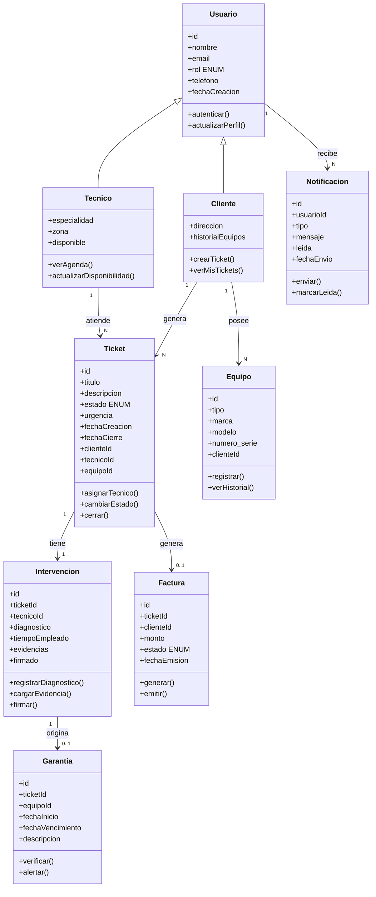

# Diagrama de clases TechServ

Referencia del diagrama UML del proyecto y su traducción al backend FastAPI.

> Ver también: [diagrama-er.md](./diagrama-er.md) (modelo relacional — fuente de verdad para migraciones) · [diagrama-secuencias.md](./diagrama-secuencias.md) · [diagrama-casos-de-uso.md](./diagrama-casos-de-uso.md) · [diagrama-actividades.md](./diagrama-actividades.md)

## Vista general (diagrama UML)

## Relaciones y cardinalidades

| Relación | Multiplicidad | Significado |
|----------|---------------|-------------|
| Usuario → Notificacion | 1 : N | Un usuario recibe muchas notificaciones |
| Tecnico → Ticket | 1 : N | Un técnico atiende muchos tickets |
| Cliente → Ticket | 1 : N | Un cliente genera muchos tickets |
| Cliente → Equipo | 1 : N | Un cliente posee muchos equipos |
| Ticket → Intervencion | 1 : 1 | Cada ticket tiene una intervención |
| Ticket → Factura | 1 : 0..1 | Un ticket puede generar una factura (opcional) |
| Intervencion → Garantia | 1 : 0..1 | Una intervención puede originar una garantía |

## Mapeo al backend (SQLAlchemy)

El diagrama usa **herencia** (`Tecnico` y `Cliente` extienden `Usuario`). En el backend se recomienda **tabla única `users` + tablas de perfil** (más simple con Supabase Auth y JWT):

| Clase UML | Tabla(s) propuesta | Notas |
|-----------|-------------------|-------|
| Usuario | `users` | Auth vía Supabase; `rol` como ENUM |
| Tecnico | `users` + `technician_profiles` | `especialidad`, `zona`, `disponible` |
| Cliente | `users` + `clients` | `direccion`; link opcional `clients.user_id` |
| Notificacion | `notifications` | Etapa 2/7 |
| Ticket | `tickets` | Etapa 1 |
| Equipo | `equipments` | Etapa 1 |
| Intervencion | `interventions` + `intervention_photos` | Etapa 3 |
| Factura | `invoices` (+ `quotes` si hay presupuesto) | Etapa 4 |
| Garantia | `warranties` | Etapa 5 |

### Atributos UML → columnas

| UML | Columna backend |
|-----|-----------------|
| `nombre` | `full_name` |
| `fechaCreacion` | `created_at` |
| `fechaCierre` | `closed_at` |
| `numero_serie` | `serial_number` |
| `tipo` (Equipo) | `name` o campo `type` |
| `monto` | `total_amount` |
| `fechaEmision` | `issued_at` |
| `fechaInicio` / `fechaVencimiento` | `start_date` / `end_date` |
| `evidencias` | tabla `intervention_photos` (lista de archivos) |

### Tipos de ID

El diagrama usa `int`; el backend usa **UUID** (compatible con Supabase `auth.users.id`).

## Estado actual del código (Etapa 0)

Implementado hoy:

- `Company` — no aparece en el diagrama; útil para multi-empresa
- `User` — cubre `Usuario` base con `role` (`cliente`, `tecnico`, `supervisor`, `administrador`, `area_administrativa`)

Pendiente según diagrama:

- `Cliente`, `Tecnico` (perfiles)
- `Ticket`, `Equipo`
- `Intervencion`, `Factura`, `Garantia`, `Notificacion`

## Métodos UML → endpoints (referencia)

| Método UML | Endpoint / servicio |
|------------|---------------------|
| `autenticar()` | Supabase Auth (frontend) + `GET /api/v1/me` |
| `actualizarPerfil()` | `PATCH /api/v1/users/{id}` |
| `crearTicket()` | `POST /api/v1/tickets` |
| `verMisTickets()` | `GET /api/v1/tickets` (filtro por rol cliente) |
| `asignarTecnico()` | `POST /api/v1/assignments` |
| `cambiarEstado()` / `cerrar()` | `PATCH /api/v1/tickets/{id}/status` |
| `verAgenda()` | `GET /api/v1/technicians/{id}/agenda` |
| `registrarDiagnostico()` | `POST /api/v1/tickets/{id}/diagnostics` |
| `cargarEvidencia()` | `POST /api/v1/interventions/{id}/photos` |
| `firmar()` | `POST /api/v1/interventions/{id}/close` |
| `generar()` / `emitir()` | `POST /api/v1/tickets/{id}/quotes`, `POST /api/v1/invoices` |
| `verificar()` / `alertar()` | validación al crear ticket + job de garantías por vencer |
| `enviar()` / `marcarLeida()` | servicio de notificaciones + FCM/email |

## Diferencias a tener en cuenta

1. **Roles extra**: el MVP incluye `supervisor` y `area_administrativa`, no solo técnico/cliente.
2. **Ticket 1:1 Intervencion**: en operación real puede haber re-aperturas; considerar 1:N si el negocio lo permite.
3. **Presupuestos**: el alcance del MVP menciona quotes antes de factura; el diagrama solo muestra `Factura`.
4. **Auth**: `autenticar()` vive en Supabase, no en FastAPI.

## Etapas del plan vs diagrama

| Etapa | Clases del diagrama |
|-------|---------------------|
| 0 ✅ | Usuario (parcial) |
| 1 | Cliente, Equipo, Ticket |
| 2 | Tecnico (+ asignación), Notificacion (básica) |
| 3 | Intervencion |
| 4 | Factura |
| 5 | Garantia |
