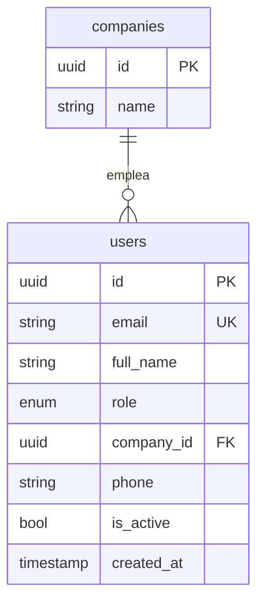

# Diagrama Entidad-Relación (E/R) TechServ

Referencia del modelo relacional del proyecto y su alineación con el backend FastAPI + PostgreSQL.

> Ver también: [diagrama-de-clases.md](./diagrama-de-clases.md) · [diagrama-secuencias.md](./diagrama-secuencias.md) · [diagrama-casos-de-uso.md](./diagrama-casos-de-uso.md) · [diagrama-actividades.md](./diagrama-actividades.md)

## Diagrama E/R (vista lógica)

```mermaid
erDiagram
    usuarios ||--o| clientes : "es un"
    usuarios ||--o| tecnicos : "es un"
    usuarios ||--o{ notificaciones : recibe

    clientes ||--o{ equipos : posee
    clientes ||--o{ tickets : genera

    tecnicos ||--o{ tickets : atiende
    equipos ||--o{ tickets : afecta

    tickets ||--|| intervenciones : tiene
    tickets ||--o| facturas : genera

    intervenciones ||--o{ evidencias : genera
    intervenciones ||--o| garantias : origina

    equipos ||--o{ garantias : ""

    usuarios {
        uuid id PK
        string nombre
        string email UK
        string password_hash
        enum rol
        string telefono
        timestamp created_at
    }

    clientes {
        uuid id PK
        uuid usuario_id FK UK
        string direccion
    }

    tecnicos {
        uuid id PK
        uuid usuario_id FK UK
        string especialidad
        string zona
        bool disponible
    }

    notificaciones {
        uuid id PK
        uuid usuario_id FK
        string tipo
        text mensaje
        bool leida
        timestamp enviada_at
    }

    equipos {
        uuid id PK
        uuid cliente_id FK
        string tipo
        string marca
        string modelo
        string nro_serie UK
        timestamp created_at
    }

    tickets {
        uuid id PK
        uuid cliente_id FK
        uuid tecnico_id FK "NULL"
        uuid equipo_id FK
        string titulo
        string descripcion
        enum estado
        enum urgencia
        timestamp created_at
        timestamp closed_at
    }

    intervenciones {
        uuid id PK
        uuid ticket_id FK UK
        text diagnostico
        int tiempo_empleado
        bool firmado
        timestamp created_at
    }

    evidencias {
        uuid id PK
        uuid intervencion_id FK
        text url
        string tipo
    }

    facturas {
        uuid id PK
        uuid ticket_id FK UK
        uuid cliente_id FK
        decimal monto
        enum estado
        timestamp fecha_emision
    }

    garantias {
        uuid id PK
        uuid intervencion_id FK
        uuid equipo_id FK
        date fecha_inicio
        date fecha_vencimiento
        string descripcion
    }
```

## Entidades y columnas (según diagrama)

### Usuarios y perfiles

| Tabla | Campos clave | Relación |
|-------|--------------|----------|
| **usuarios** | `id` PK, `email` UNIQUE, `rol` ENUM, `password_hash` | Base de identidad |
| **clientes** | `id` PK, `usuario_id` FK → usuarios | 1:1 con usuarios (rol cliente) |
| **tecnicos** | `id` PK, `usuario_id` FK → usuarios, `disponible` BOOL | 1:1 con usuarios (rol técnico) |
| **notificaciones** | `usuario_id` FK, `leida` BOOL, `enviada_at` | N:1 con usuarios |

### Operación

| Tabla | Campos clave | Relación |
|-------|--------------|----------|
| **equipos** | `cliente_id` FK, `nro_serie` UNIQUE | N:1 con clientes |
| **tickets** | `cliente_id`, `tecnico_id` (NULL), `equipo_id`, `estado`, `urgencia` | N:1 cliente/técnico/equipo |
| **intervenciones** | `ticket_id` FK **UNIQUE** (1:1) | 1:1 con tickets |
| **evidencias** | `intervencion_id` FK, `url`, `tipo` | N:1 con intervenciones |

### Administración

| Tabla | Campos clave | Relación |
|-------|--------------|----------|
| **facturas** | `ticket_id` FK **UNIQUE**, `cliente_id`, `monto` | 0..1 por ticket |
| **garantias** | `intervencion_id` FK, `equipo_id` FK | 0..1 por intervención |

## Relaciones y cardinalidades

| Desde | Hacia | Cardinalidad | Etiqueta |
|-------|-------|--------------|----------|
| usuarios | clientes | 1 : 0..1 | es un |
| usuarios | tecnicos | 1 : 0..1 | es un |
| usuarios | notificaciones | 1 : N | recibe |
| clientes | equipos | 1 : N | posee |
| clientes | tickets | 1 : N | genera |
| tecnicos | tickets | 1 : N | atiende |
| equipos | tickets | 1 : N | afecta |
| tickets | intervenciones | 1 : 1 | tiene |
| tickets | facturas | 1 : 0..1 | genera |
| intervenciones | evidencias | 1 : N | genera |
| intervenciones | garantias | 1 : 0..1 | origina |

## Mapeo E/R → backend (SQLAlchemy)

Nombres en inglés en código; semántica igual al diagrama.

| Tabla E/R | Tabla backend | Etapa |
|-----------|---------------|-------|
| usuarios | `users` | 0 ✅ |
| — | `companies` | 0 ✅ (extra MVP multi-empresa) |
| clientes | `clients` | 1 |
| tecnicos | `technicians` o `technician_profiles` | 2 |
| equipos | `equipments` | 1 |
| tickets | `tickets` | 1 |
| intervenciones | `interventions` | 3 |
| evidencias | `evidence` / `intervention_photos` | 3 |
| facturas | `invoices` | 4 |
| garantias | `warranties` | 5 |
| notificaciones | `notifications` | 2 / 7 |

### Equivalencia de columnas

| E/R | Backend |
|-----|---------|
| `nombre` | `full_name` |
| `password_hash` | *(no en DB — Supabase Auth)* |
| `nro_serie` | `serial_number` |
| `tiempo_empleado` | `time_logs.minutes` o campo en `interventions` |
| `url` (evidencias) | `storage_path` (Supabase Storage) |
| `enviada_at` | `sent_at` |
| `fecha_emision` | `issued_at` |

## Estado actual (Etapa 0)



**Implementado:** `companies`, `users`  
**Pendiente:** resto del diagrama E/R

## Diferencias E/R vs diagrama de clases

| Aspecto | Diagrama de clases | Diagrama E/R |
|---------|-------------------|--------------|
| Usuario/Técnico/Cliente | Herencia (subclases) | Tablas separadas + FK `usuario_id` |
| Garantía | `ticketId` + `equipoId` | `intervencion_id` + `equipo_id` |
| Evidencias | Lista en Intervención | Tabla `evidencias` propia |
| Técnico en ticket | `tecnicoId` en Ticket | FK a `tecnicos.id` (no a `usuarios`) |
| Password | método `autenticar()` | columna `password_hash` |

**Recomendación:** seguir el **E/R** para migraciones Alembic; es más explícito para PostgreSQL. La garantía ligada a `intervencion_id` es más precisa que solo `ticket_id`.

## Diferencias E/R vs backend actual

| E/R | Backend Etapa 0 | Acción |
|-----|-----------------|--------|
| `password_hash` en usuarios | Auth en Supabase | No agregar columna; JWT externo |
| Solo roles cliente/técnico implícitos | 5 roles en `users.role` | Mantener ENUM ampliado del MVP |
| Sin `companies` | Tabla `companies` | Conservar para multi-tenant |
| UUID en diagrama | UUID + sync Supabase | `users.id` = `auth.users.id` |

## Orden sugerido de migraciones (post Etapa 0)

1. **002** — `clients`, `technicians`, `equipments`
2. **003** — `tickets` (+ índices `estado`, `urgencia`, `created_at`)
3. **004** — `interventions`, `evidence`
4. **005** — `notifications`
5. **006** — `invoices`
6. **007** — `warranties`

## ENUMs inferidos del E/R

```sql
-- tickets.estado
'abierto', 'en_diagnostico', 'en_proceso', 'resuelto', 'cerrado'

-- tickets.urgencia
'baja', 'media', 'alta', 'critica'

-- usuarios.rol (MVP)
'cliente', 'tecnico', 'supervisor', 'administrador', 'area_administrativa'

-- facturas.estado
'pendiente', 'pagada', 'cancelada'
```

## Constraints importantes del diagrama

- `intervenciones.ticket_id` → **UNIQUE** (1 intervención por ticket)
- `facturas.ticket_id` → **UNIQUE** (como mucho una factura por ticket)
- `equipos.nro_serie` → **UNIQUE**
- `tickets.tecnico_id` → **NULL** hasta asignación

Estos constraints deben reflejarse en modelos SQLAlchemy y migraciones Alembic al implementar cada etapa.
