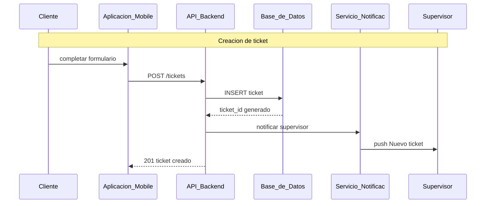
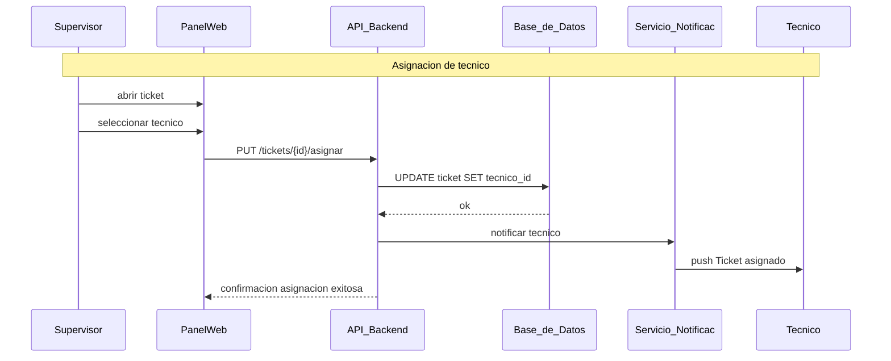

# Diagrama de secuencias TechServ

Flujos operativos del sistema según el diagrama de secuencia del proyecto.

> Ver también: [diagrama-er.md](./diagrama-er.md) · [diagrama-de-clases.md](./diagrama-de-clases.md) · [diagrama-casos-de-uso.md](./diagrama-casos-de-uso.md) · [diagrama-actividades.md](./diagrama-actividades.md)

## Participantes

| Actor / sistema | Rol |
|-----------------|-----|
| Cliente | Usuario final que solicita servicio |
| Aplicación Móvil | Frontend móvil (cliente) |
| API Backend | FastAPI (`techserv-backend`) |
| Base de Datos | PostgreSQL |
| Servicio Notificac. | Push / email (FCM, Resend, etc.) |
| Supervisor | Rol operativo web |
| PanelWeb | Frontend web (Next.js) |
| Técnico | Rol de campo |

---

## Flujo 1: Creación de ticket



### Pasos (numerados en el diagrama)

| # | Acción |
|---|--------|
| 1 | Cliente completa formulario en la app móvil |
| 2 | App envía `POST /tickets` al backend |
| 3 | Backend hace `INSERT` en tabla `tickets` |
| 4 | DB devuelve `ticket_id` generado |
| 5 | Backend pide notificar al supervisor |
| 6 | Servicio de notificaciones envía push *"Nuevo ticket #id"* |

### Implementación backend (Etapa 1 + 2)

| Diagrama | Propuesta FastAPI | Notas |
|----------|-------------------|-------|
| `POST /tickets` | `POST /api/v1/tickets` | JWT rol `cliente` (o operador) |
| `INSERT ticket` | SQLAlchemy → `tickets` | FK: `cliente_id`, `equipo_id`, etc. |
| Respuesta | `201` + body con `id` | Pydantic `TicketRead` |
| Notificación | Servicio async post-commit | No bloquear la respuesta al cliente |

**Payload esperado** (alineado al E/R):

```json
{
  "client_id": "uuid",
  "equipment_id": "uuid",
  "title": "string",
  "description": "string",
  "urgency": "alta"
}
```

**Auth:** el diagrama no muestra JWT; en la implementación la app móvil envía `Authorization: Bearer <token>` (Supabase).

---

## Flujo 2: Asignación de técnico



### Pasos (numerados en el diagrama)

| # | Acción |
|---|--------|
| 7 | Supervisor abre ticket y elige técnico en el panel web |
| 8 | Panel envía `PUT /tickets/{id}/asignar` |
| 9 | Backend actualiza `tecnico_id` en `tickets` |
| 10 | DB confirma |
| 11 | Backend notifica al técnico |
| 12 | Push *"Ticket asignado"* al técnico |
| — | Respuesta de éxito al panel web |

### Implementación backend (Etapa 2)

| Diagrama | Propuesta FastAPI | Notas |
|----------|-------------------|-------|
| `PUT /tickets/{id}/asignar` | `PUT /api/v1/tickets/{id}/assign` **o** `POST /api/v1/assignments` | Ver decisión abajo |
| `UPDATE tecnicoId` | `tickets.tecnico_id = …` **o** fila en `assignments` | E/R usa FK directa en ticket |
| Auth | Rol `supervisor` o `administrador` | `require_roles(...)` |

**Body sugerido:**

```json
{
  "technician_id": "uuid"
}
```

### Decisión de diseño: PUT vs tabla assignments

El **diagrama** actualiza `tecnico_id` en `tickets` (coincide con el E/R).

Alternativa del plan original: tabla `assignments` (auditoría de quién asignó y cuándo). Opciones:

| Enfoque | Pros |
|---------|------|
| Solo `tickets.tecnico_id` | Simple, fiel al diagrama/E/R |
| `assignments` + opcional sync en ticket | Historial, notas, reasignaciones |

**Recomendación:** empezar con `tickets.tecnico_id` como en el diagrama; agregar `assignments` si necesitan historial de reasignaciones.

---

## Endpoints resumidos (según secuencia)

| Método | Ruta (diagrama) | Ruta backend | Etapa | Rol |
|--------|-----------------|--------------|-------|-----|
| POST | `/tickets` | `/api/v1/tickets` | 1 | cliente |
| PUT | `/tickets/{id}/asignar` | `/api/v1/tickets/{id}/assign` | 2 | supervisor |

---

## Servicio de notificaciones

El diagrama separa **Servicio Notificac.** como participante externo.

```
API Backend ──► NotificationService ──► FCM (técnico / supervisor)
                                      └──► Email (opcional)
                                      └──► INSERT notificaciones (persistencia)
```

| Evento | Destinatario | Mensaje |
|--------|--------------|---------|
| Ticket creado | Supervisor(es) | `Nuevo ticket #{id}` |
| Técnico asignado | Técnico | `Ticket asignado` |

Implementación sugerida:
- Llamada **async** después del commit (BackgroundTasks o Celery en etapas posteriores).
- Registrar en tabla `notificaciones` (E/R) para historial e inbox.

---

## Validaciones de negocio implícitas

**Creación de ticket**
- Cliente autenticado y vinculado a `clientes.usuario_id`
- `equipo_id` pertenece al cliente
- `estado` inicial: `abierto`
- `tecnico_id`: NULL

**Asignación**
- Ticket existe y no está `cerrado`
- Técnico existe y `disponible = true`
- Solo supervisor/admin puede asignar

---

## Estado actual del backend

| Flujo | Estado |
|-------|--------|
| Creación de ticket | Pendiente (Etapa 1) |
| Asignación de técnico | Pendiente (Etapa 2) |
| Notificaciones | Pendiente (Etapa 2) |
| JWT en requests | ✅ Etapa 0 (`GET /me`, CRUD users) |

---

## Checklist para implementar estos flujos

### Etapa 1 — Creación
- [ ] Modelo `tickets` + migración Alembic
- [ ] `POST /api/v1/tickets`
- [ ] RBAC: cliente solo crea para sí; supervisor ve todos
- [ ] Test de integración: POST → 201 + id

### Etapa 2 — Asignación + notificaciones
- [ ] `PUT /api/v1/tickets/{id}/assign` (o equivalente)
- [ ] Actualizar `tickets.tecnico_id`
- [ ] Stub/servicio de notificaciones
- [ ] Test: assign → técnico_id persistido
